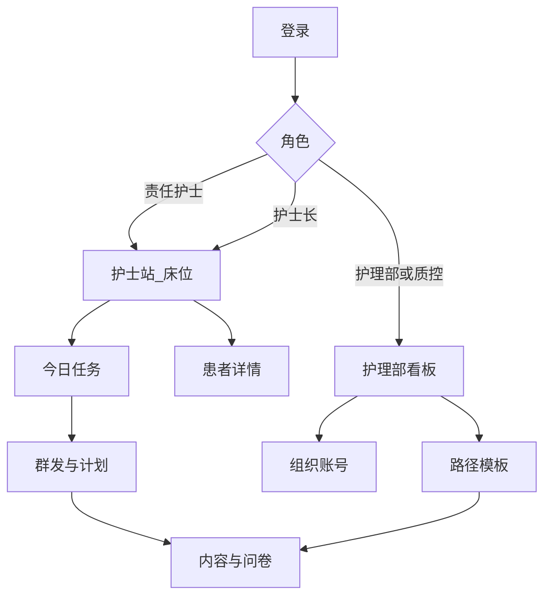
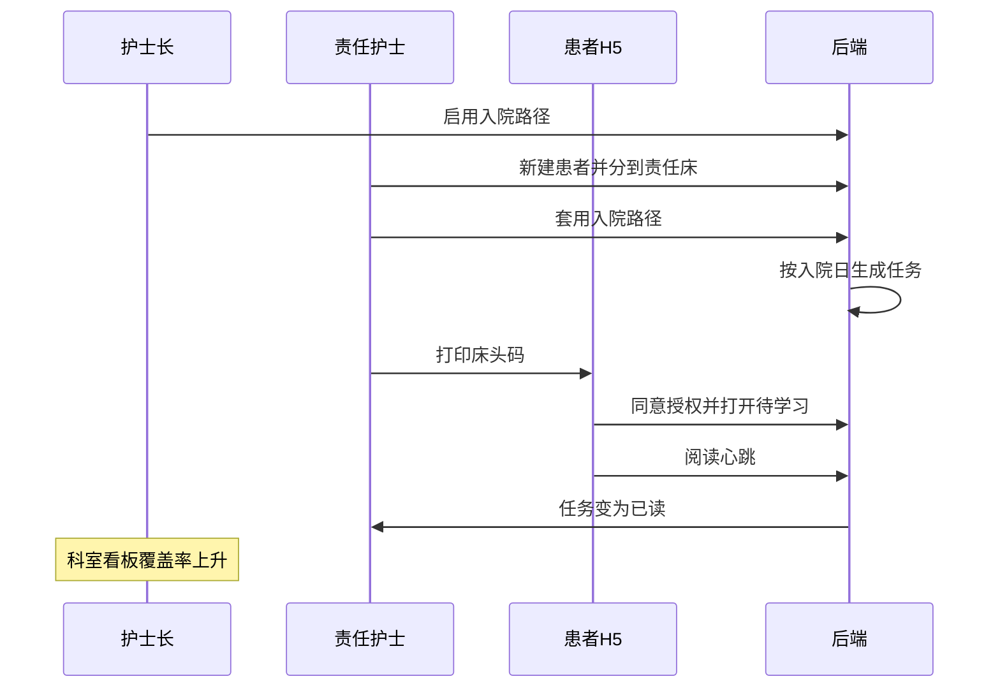

# SaaS Web 信息架构与页面清单

对应勾选文档 [01-SaaS测试期功能勾选.md](01-SaaS测试期功能勾选.md)。两端：**医护 Web**（护理部 / 护士长 / 责任护士 / 只读质控）和 **患者 H5**。同一后端，小程序期只加客户端，不改信息架构主路径。

## 1. 原则

- 护士站默认「我的责任床」，护士长一键切「全科」。
- 路径、内容、计划在 Web 配置；H5 只消费「发给我的任务 + 本科室宣教中心」。
- 复杂向导（群发、计划、路径）不做进小程序；小程序将来只做床位、任务、扫码。
- 路由稳定：`/app/*` 医护，`/p/*` 患者。患者链接可打印成床头码。

## 2. 角色与导航

| 能力 | 护理部 | 护士长 | 责任护士 | 只读质控 | 患者 |
| --- | --- | --- | --- | --- | --- |
| 组织与账号 | 读写 | 本科室成员 | 只读本科室 | 无 | 无 |
| 路径模板 | 全院读写 | 本科启用 | 套用、不可改模板 | 只读 | 无 |
| 内容 / 问卷 | 全院 | 本科室读写 | 本科室读写（可关） | 只读 | 阅读 / 作答 |
| 床位与分床 | 只读 | 分床 | 领床范围内操作 | 只读 | 无 |
| 群发 / 计划 | 可关 | 本科室 | 默认责任床 | 无 | 无 |
| 今日任务 | 可下钻 | 全科 | 责任床 | 只读 | 待学习列表 |
| 看板与导出 | 全院 | 科室 | 本人数据 | 全院只读 | 无 |
| 审计 | 全院 | 本科室 | 无 | 全院只读 | 无 |
| 宣教设置 | 默认模板 | 本科室 | 无 | 无 | 授权文案 |

## 3. 站点地图

### 3.1 医护 Web `/app`

| 路由 | 页面 | 主角色 | 覆盖功能编号 |
| --- | --- | --- | --- |
| `/app/login` | 登录（手机号 + 密码/验证码） | 全部医护 | 01.3 |
| `/app/home` | 角色落地页：护士进床位，护理部进看板 | 全部 | — |
| `/app/ward` | 床位图。护士默认责任床；护士长可切全科 | 护士长、责任护士 | 02.1、02.4、05.5 |
| `/app/ward/beds/:bedId` | 床位详情：患者档案、标记组、宣教码、阅读、套路径、转床/出院 | 同上 | 02.3、02.5、02.6、02.9、04.4、08.2 |
| `/app/tasks` | 今日任务：待推 / 已推未读 / 需当面补讲 | 护士长、责任护士 | 08.3 |
| `/app/push/new` | 群发向导：内容 → 筛选 → 立即/定时 | 护士长、责任护士 | 05.1、05.2、05.5 |
| `/app/push/jobs` | 群发记录：发送人、时间、已读/应发、重发 | 同上 | 05.4、05.2 |
| `/app/plans` | 智能推送计划列表 | 护士长为主 | 06.1 |
| `/app/plans/:id` | 计划编辑：人群、锚点、相对时间、内容、启停 | 护士长 | 06.1、06.2 |
| `/app/content` | 文章列表 + 分类树 | 护士长、责任护士、护理部 | 03.1、03.2 |
| `/app/content/:id` | 文章编辑/预览 | 同上 | 03.1 |
| `/app/surveys` | 问卷列表 | 同上 | 09.1 |
| `/app/surveys/:id` | 问卷编辑 | 同上 | 09.1 |
| `/app/surveys/:id/responses` | 回收明细与导出 | 护士长、护理部、质控 | 09.3 |
| `/app/pathways` | 路径模板库 | 护理部写，护士长启用 | 04.1、04.3、04.4 |
| `/app/pathways/:id` | 路径编辑：步骤时间 + 条目 | 护理部、护士长 | 04.1、04.3 |
| `/app/team` | 本科室成员与分床 | 护士长 | 01.2、02.4 |
| `/app/settings/education` | 宣教设置：自动出院天数、服务电话、授权文案开关 | 护士长 | 13.3、16.3 |
| `/app/stats/ward` | 科室看板 | 护士长 | 12.1 |
| `/app/stats/members` | 成员数据 | 护士长、护理部 | 12.2 |
| `/app/nursing` | 护理部总览：科室对比、时间筛选、导出 | 护理部、质控 | 12.3 |
| `/app/org` | 医院/院区/科室/病区树与账号 | 护理部 | 01.1、01.2 |
| `/app/audit` | 操作审计 | 护理部、质控、护士长（本科） | 16.1、16.2 |

责任护士 **不进入** `/app/org`、`/app/nursing`、`/app/audit`。内容是否允许责任护士新建，由宣教设置默认「允许」，测试期保持简单。

### 3.2 患者 H5 `/p`

链接形态：`/p/{stayToken}/...`。`stayToken` 绑定一次在院经历，印在床头码上；转床换码或同码改指向，出院后短链只读历史、不再收新任务（自动出院按设置）。

| 路由 | 页面 | 覆盖功能编号 |
| --- | --- | --- |
| `/p/:token/consent` | 首次进入：知情授权文案，同意后进中心 | 16.3 |
| `/p/:token/center` | 宣教中心：按分类浏览本科室已发布内容 | 11.1、03.2 |
| `/p/:token/inbox` | 我的消息：待学习 / 已完成 | 11.2 |
| `/p/:token/items/:taskId` | 任务落地：文章或问卷 | 07.1、09.2 |
| `/p/:token/articles/:id` | 文章阅读；心跳上报停留时长 | 08.1 |
| `/p/:token/surveys/:id` | 填问卷 | 09.1、09.2 |

患者无登录账号。身份 = 扫码/短链 token。家属共用床头码即共用该 stay（扫码人数上限为 P1，本期不限）。

## 4. 关键页面说明

### 4.1 床位图 `/app/ward`

- 宫格：床号、姓名脱敏、责任护士、未读红点、标记组色点。
- 顶栏：责任床 | 全科（护士长）、搜索姓名。
- 空床显示「绑定患者 / 打印宣教码」。
- 点床卡进详情，不在宫格上做群发。

### 4.2 患者详情 `/app/ward/beds/:bedId`

分区：档案（02.3）→ 标记组（02.5）→ 已套路径与任务（04.4、08.3）→ 阅读详情（08.2）→ 宣教码下载（02.6）→ 转床/出院（02.9）。

主按钮：**套用路径**、**立即推一条**（复用群发向导且患者已选中）。

手术日无 HIS：档案里手填「手术日期」，供 06.2 锚点。

### 4.3 今日任务 `/app/tasks`

三个 Tab，条数即护士长交班数字：

1. 待推：路径/计划已到期，尚未成功投递到 H5 收件箱。
2. 已推未读：已投递，未达有效阅读阈值。
3. 需当面补讲：路径条目勾了「须当面」或护士手动标记。

本期不做签收、转交、催办（08.4–08.5）。护士在列表点「已当面完成」即可关掉补讲条，作为最小闭环。

### 4.4 群发向导 `/app/push/new`

三步：选文章或问卷或纯通知 → 筛（在院/出院、标记组、责任床/全科）→ 立即或定时。提交后生成 `PushJob` + 每患者一条 `PushTask`。

### 4.5 路径编辑 `/app/pathways/:id`

步骤行：`锚点 + 偏移`（如入院日 + 0 天 09:00）+ 内容条目列表。启用范围：全院模板由护理部下发，护士长「启用到本科」。责任护士不能改模板，只能套用。

### 4.6 护理部看板 `/app/nursing`

指标与材料对齐，但只用测试包能算的：扫码入组数、阅读患者率、有效阅读率、人均停留、未读人数、问卷回收数。筛选：时间、科室。导出 Excel 脱敏（16.2）。

## 5. 用户旅程

### 5.1 入院宣教（主演示）

### 5.2 临时群发满意度

护士长打开群发 → 选问卷 → 筛选在院 + 全科 → 立即发送 → 患者收件箱出现问卷 → 回收明细导出。

### 5.3 智能计划（扫码后自动）

护士长建计划：标记组「糖尿病」、锚点首次扫码、+1 天 10:00、饮食指导文章。患者扫码入组后，调度器到期写入任务并进入 H5 收件箱。护士无需再点发送。

## 6. 小程序期页面映射（本期不实现，路由预留）

| 小程序页 | 复用的 Web 能力 | 不搬进小程序 |
| --- | --- | --- |
| 医护：责任床位、任务、扫一扫、简单「推这一条」 | `/app/ward`、`/app/tasks` | 路径编辑、计划编辑、组织树 |
| 患者：宣教中心、收件箱、阅读、问卷 | `/p/*` | — |
| 订阅消息 | 投递渠道从 `h5_link` 增 `wechat_subscribe` | 服务号模板（后置） |

医护 Web 信息架构在小程序期保持为「配置与质控中台」。
