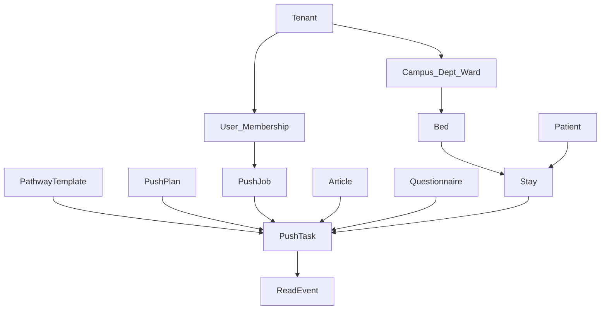
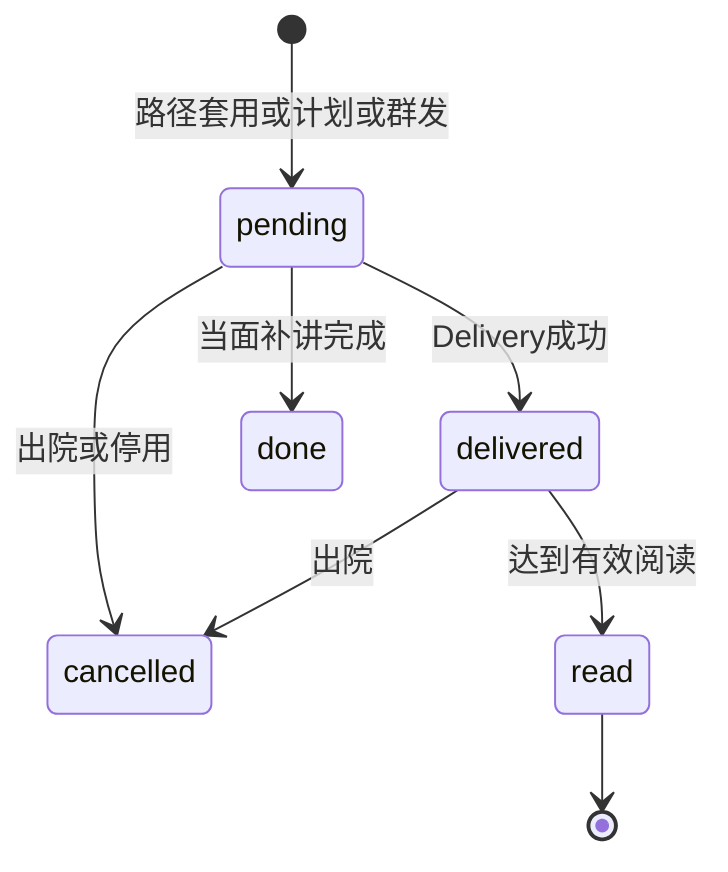
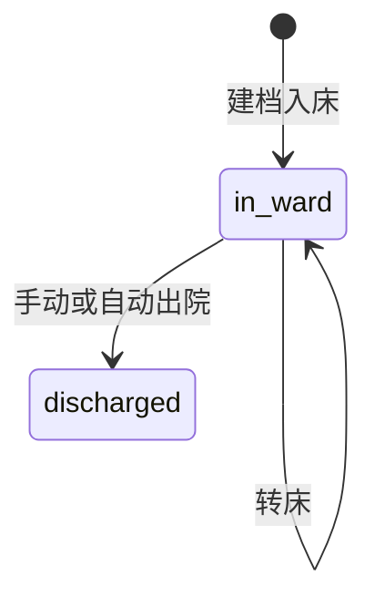

# 多端数据模型

目标：SaaS Web 与患者 H5 共用一套实体；微信小程序只增加绑定与投递渠道，不拆第二套「推送/阅读」表。字段名用英文（实现），说明用中文。

## 1. 原则

- **租户是第一列**：所有业务表带 `tenant_id`，查询默认带租户，导出不得跨租户。
- **在院经历与人分开**：`Patient` 是人，`Stay` 是这一次入科。床头码、任务、阅读都挂在 `Stay` 上，避免转床/再入院串数据。
- **任务是唯一执行对象**：路径套用、群发、智能计划最后都写成 `PushTask`。护士待办、患者收件箱、阅读统计都读任务，不各算各的。
- **阅读是事件流**：`ReadEvent` 只追加；任务上的 `read_status` 是投影，便于列表。
- **渠道可插拔**：`Delivery` 记录每一次触达。本期只有 `qr_h5`；以后加 `sms`、`wechat_subscribe` 不改任务表。

## 2. 组织与账号

### Tenant

SaaS 医院租户。

| 字段 | 类型 | 说明 |
| --- | --- | --- |
| id | uuid | |
| name | string | 医院名 |
| slug | string | 子域或登录标识 |
| status | enum | `active` / `suspended` |
| created_at | datetime | |

### Campus / Department / Ward

对应 01.1。Department 是科室（神经内科），Ward 是病区（如神内一病区）。测试期一个 Campus、一个 Department、一个 Ward 即可。

| 实体 | 关键字段 |
| --- | --- |
| Campus | tenant_id, name |
| Department | tenant_id, campus_id, name, code |
| Ward | tenant_id, department_id, name, ward_type=`inpatient` |

`ward_type` 预留 `outpatient` / `day_surgery` / `exam`（02.2 延期，枚举先留下）。

### User / Membership / Role

| 字段 | 说明 |
| --- | --- |
| User.id, phone, password_hash, name | 01.3；phone 全局或租户内唯一，测试期租户内唯一 |
| Membership.user_id, tenant_id, department_id, ward_id, role | role = `nursing_admin` / `head_nurse` / `primary_nurse` / `qa_readonly` |
| wechat_openid | **可空，小程序期再填**，本期不做微信登录 |

一人可多 Membership（轮转）。请求上下文：`tenant_id + membership_id`。

## 3. 床位、患者、在院

### Bed

| 字段 | 说明 |
| --- | --- |
| id, tenant_id, ward_id | |
| code | 床号，病区内唯一 |
| primary_nurse_id | 责任护士 User.id，可空 |
| qr_token | 床头码当前 token；转床可换 |

### Patient

| 字段 | 说明 |
| --- | --- |
| id, tenant_id | |
| display_name | 展示名 |
| name_masked | 脱敏名（张\*） |
| phone_encrypted | 可选，导出受 16.2 控制 |
| external_his_id | **可空，HIS 后置** |

### Stay（一次在院/在科）

| 字段 | 说明 |
| --- | --- |
| id, tenant_id, patient_id, ward_id, bed_id | |
| status | `in_ward` / `discharged` |
| admitted_at | 入科时间；锚点「入院日」 |
| surgery_at | 可空，护士手填；锚点「手术日」 |
| discharged_at | |
| first_scan_at | 首次打开 H5；锚点「首次扫码」 |
| access_token | H5 路径 `/p/{token}`，高熵，不可猜测 |
| consent_accepted_at | 16.3 |
| auto_discharge_on | 按宣教设置的平均住院天数计算 |

02.9：转床改 `bed_id` 并写审计；出院改 status；调度器把到期 `auto_discharge_on` 置 discharged，未完成任务关闭原因为 `stay_ended`。

### TagGroup / StayTag

02.5。TagGroup 属科室：`name`、`color`。StayTag 把 Stay 加入组，供群发筛选与计划圈人。

### EducationSettings（13.3）

每科室一行：`auto_discharge_days`（默认 30）、`hotline`、`hotline_label`、`consult_enabled=false`（占位）、`consent_text`。

## 4. 内容

### EducationCategory

03.2。树：入院、出院、检查、手术、疾病、护理、饮食、用药、康复。`department_id` + `parent_id` + `sort_order`。

### Article

| 字段 | 说明 |
| --- | --- |
| id, tenant_id, department_id, category_id | |
| title, cover_url, body_richtext | 03.1 富文本，非秀米 |
| media_type | `richtext` / `audio` / `video` |
| media_url | 音视频 |
| status | `draft` / `published` |
| published_at | |

院内共享、疾病标签、绑问卷为 P1，表上可留 `shared_scope` 默认 `department`，本期 UI 不开放。

### Questionnaire / Question / QuestionOption / SurveyResponse

09.1–09.3。题型 `single` / `multiple` / `text`。`SurveyResponse` 挂 `stay_id + questionnaire_id + task_id`，答案 JSON 或子表。导出读 Response。评分公式（09.4）不建表。

## 5. 路径模板

### PathwayTemplate / PathwayStep / PathwayStepItem

04.1、04.3。

**PathwayTemplate**：tenant_id，name（如「普通入院宣教」），department_id 可空表示全院，status `draft`/`active`，version 整数（04.5 延期，先只留字段不开放审核流）。

**PathwayStep**：

| 字段 | 说明 |
| --- | --- |
| anchor | `admitted_at` / `surgery_at` / `discharged_at` / `first_scan_at` |
| offset_days | 可负（术前 1 天 = surgery_at - 1） |
| send_time | 当日时刻，如 09:00 |

**PathwayStepItem**：`content_type` = `article` / `questionnaire` / `notice` / `bedside_required`；对应 `article_id` / `questionnaire_id` / 通知正文；`bedside_required` 为真时任务进「当面补讲」。

### DepartmentPathway

护士长启用：`department_id + template_id + enabled`。04.4。

### StayPathway

责任护士套用：`stay_id + template_id + applied_by + applied_at`。套用当时 **把步骤物化成 PushTask**（按当时入院日计算 `due_at`）。之后改模板不影响已套用患者；这是为了审计和避免「改模板改了在院病人」。

## 6. 群发与智能计划

### PushJob（05.x）

一次人工群发。

| 字段 | 说明 |
| --- | --- |
| source | `manual` |
| content_type / article_id / questionnaire_id / notice_body | |
| filter_json | 在院状态、标记组、责任床或全科 |
| schedule_at | 空 = 立即 |
| created_by | |
| stats_sent, stats_read | 投影，05.4 |

### PushPlan（06.x）

| 字段 | 说明 |
| --- | --- |
| name, department_id, enabled | |
| tag_group_id | 人群；也可后期加 pathway，本期用标记组 |
| anchor | 同 PathwayStep.anchor |
| offset_days, send_time | |
| content_* | 同一套内容类型 |
| last_run_at | |

调度：Stay 满足标记组且锚点时间已到、尚未为该 plan+stay 生成过任务 → 插入 PushTask。手术日为空则跳过 `surgery_at` 计划并在护士长计划页显示「缺手术日人数」。

## 7. 推送任务与投递（核心）

### PushTask

| 字段 | 说明 |
| --- | --- |
| id, tenant_id, stay_id | |
| source_type | `pathway` / `manual_job` / `plan` |
| source_id | 对应模板/job/plan |
| content_type | `article` / `questionnaire` / `notice` / `bedside` |
| article_id / questionnaire_id / notice_body | |
| due_at | 到期应推时间 |
| status | 见状态机 |
| assigned_nurse_id | 生成时快照责任护士，便于 12.2 |
| effective_read_at | 达到阈值的时间 |
| bedside_done_at | 护士点「已当面完成」 |

**status**：`pending`（待推）→ `delivered`（已进收件箱）→ `read`（有效阅读）或保持 `delivered`（未读）。`bedside` 类：`pending` → `done`。Stay 结束：`cancelled`。

今日任务 Tab 映射：

- 待推 = `pending` 且 due_at ≤ now
- 已推未读 = `delivered` 且未达阈值
- 需当面补讲 = `bedside` 未 done，或条目要求当面且阅读未完成（测试期仅前者，避免规则打架）

### Delivery

| 字段 | 说明 |
| --- | --- |
| task_id | |
| channel | `qr_h5`（本期唯一） |
| payload | 短链 URL |
| status | `sent` / `failed` |
| attempted_at | |

小程序期新增 channel `wechat_subscribe`，新行即可。重发（05.2）= 新 Delivery，任务仍是同一条。

### ReadEvent（08.1）

只追加。

| 字段 | 说明 |
| --- | --- |
| stay_id, task_id, article_id | |
| event_type | `open` / `heartbeat` / `complete` |
| duration_ms | heartbeat/complete 携带累计 |
| client | `h5` / 预留 `mp` |
| occurred_at | |

有效阅读：累计停留 ≥ 科室阈值（EducationSettings.effective_read_seconds，默认 30）。达到后任务 `status=read`，`effective_read_at` 赋值。心跳 10–15 秒一次，H5 隐藏即停。

## 8. 质控、审计、授权

### Metric 不落宽表

12.1–12.3 由查询计算：时间范围内 Stay 数、有有效阅读的 Stay 数、任务已读/应发、按 `assigned_nurse_id` 聚合。结果可缓存，但以任务和事件为真相。

### AuditLog（16.1）

| 字段 | 说明 |
| --- | --- |
| tenant_id, actor_user_id, membership_id | |
| action | `stay.create` / `pathway.apply` / `job.send` / `stay.discharge` / `export.survey` … |
| target_type, target_id | |
| stay_id | 可空 |
| payload_json | 不含明文手机号 |
| ip, occurred_at | |

### 脱敏（16.2）

API 对 `primary_nurse` / `head_nurse` 返回 display_name；`qa_readonly` / 导出默认 `name_masked` + 无手机号。护理部导出需二次确认角色。

### Consent

Stay.consent_accepted_at + EducationSettings.consent_text 版本号（`consent_version`）。改文案不影响已同意患者。无单独签字表（08.6 延期）。

## 9. 状态机

## 10. 建议 API 资源（前后端与小程序共用）

前缀 `/api/v1`，均需租户上下文。患者 H5 用 `Authorization: Stay-Token`，不能用医护 JWT。

| 方法 | 路径 | 说明 |
| --- | --- | --- |
| POST | `/auth/login` | 医护手机号登录 |
| GET | `/me` | 当前 membership、角色 |
| GET/PATCH | `/org/...` | 组织树与成员 |
| GET/POST | `/wards/:id/beds` | 床位图、分床 |
| POST | `/stays` | 入科 |
| POST | `/stays/:id/apply-pathway` | 套路径 |
| GET | `/tasks` | 今日任务筛选 |
| POST | `/push-jobs` | 群发 |
| CRUD | `/push-plans` | 智能计划 |
| CRUD | `/articles` `/categories` `/questionnaires` `/pathways` | 内容中台 |
| GET | `/stats/ward` `/stats/members` `/stats/nursing` | 看板 |
| GET | `/audit` | 审计 |
| GET | `/p/stays/current` | H5：授权状态、科室信息 |
| POST | `/p/consent` | H5：同意 |
| GET | `/p/inbox` `/p/center` | H5：收件箱与中心 |
| POST | `/p/read-events` | H5：阅读心跳 |

小程序期：`POST /auth/wechat`、`POST /p/wechat-bind`，任务与阅读 API 不变。

## 11. 调度与导入（测试期无 HIS）

- **导入**：Excel 列（床号、姓名、入科时间、诊断标签）→ Patient + Stay + 可选 Tag。
- **调度**：每分钟扫描 `PushPlan` 与到期 `pending` 任务；立即群发在请求内同步生成任务并写 Delivery（channel=qr_h5，收件箱可见即视为 delivered）。
- **自动出院**：每日 00:05 按 `auto_discharge_on` 处理。

## 12. 小程序扩展点（表已留、本期不用）

| 扩展 | 做法 |
| --- | --- |
| 微信登录 | User.wechat_openid |
| 患者微信 | StayWechatBinding(stay_id, openid) 新表，或 Stay 上可空字段 |
| 订阅消息 | Delivery.channel 新枚举值 |
| 咨询 | 新表 ConsultThread，与 PushTask 无关，避免污染作业闭环 |
| HIS | Patient.external_his_id；Stay 上 his_event_id；写入适配器生成任务，仍落 PushTask |

只要新客户端继续写 `PushTask` + `ReadEvent` + `Delivery`，护理部看板不用改口径。
