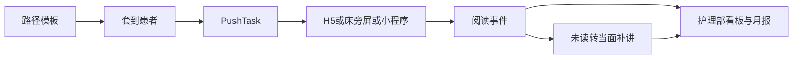

# 护理推送平台 · 功能与用例分析

- 版本：V1.0
- 日期：2026-09-20
- 范围基线：桌面勾选表《护理推送平台-功能勾选表(2).xlsx》（纳入 59 / 延期 3 / 不做 38）
- 本文是 MRD、PRD 的分析底稿。功能编号与勾选表一致。

## 1. 分析结论

产品要证明的故事不变：**护士长配置路径 → 责任护士套到床位 → 患者在床头码 / H5 / 床旁屏学习 → 未读进入当面补讲 → 护理部看到覆盖率、24 小时路径完成率和月报。**

相对「建议测试包 37 项」，勾选把内容中台、路径审核、未读补推、满意度、月报、小程序和床旁屏码做进范围；同时整模块砍掉咨询、短信、HIS、签字交班和 AI。门诊名单、扫码人数上限、家属单独策略只延期，不进本期开发。

两处实施口径（避免做错产品）：

1. **15.2 纳入、15.1 不做**：没有培训课件库。分层考试 = 问卷（09.1）+ 评分等级（09.4）+ 指定护士层级对象 + 成绩汇总。
2. **07.6 纳入、16.6 不做**：只生成可被床旁屏浏览器打开的宣教码 / 同一条 H5 链接，不对接屏厂 SDK。

## 2. 角色

| 角色 | 在系统里做什么 | 不做什么 |
| --- | --- | --- |
| 护理部 | 组织账号、全院路径与内容、质控看板、月报、考试成绩 | 日常管床、点对点推送 |
| 护士长 | 启用/审核路径、分床、群发确认、本科计划、科室看板 | 改全院组织树 |
| 责任护士 | 建档、套路径、打码、看阅读、当面补讲完成、本科内容 | 进审计、改路径模板、回复咨询（咨询不做） |
| 只读质控 | 看板、导出、审计 | 发送、分床、改内容 |
| 患者 / 家属 | 授权、填入科表单、读宣教、填问卷/考试 | 账号体系（身份 = Stay Token） |
| 系统管理员 | 租户开通、渠道开关 | 临床操作 |

## 3. 勾选对照

### 3.1 纳入（59）

| 编号 | 功能 | 期次 |
| --- | --- | --- |
| 01.1 | 医院 / 院区 / 科室 / 病区树 | P1 |
| 01.2 | 护理部、护士长、责任护士、只读质控 | P1 |
| 01.3 | 手机号 + 密码 / 验证码登录 | P1 |
| 01.4 | 科室二维码邀请医护加入 | P1 可用邀请链接；P2 做成微信码 |
| 02.1 | 床位图 / 床卡列表 | P1 |
| 02.3 | 患者档案 | P1 |
| 02.4 | 责任床位分配 | P1 |
| 02.5 | 标记组 | P1 |
| 02.6 | 床头宣教码、扫码入科 | P1 |
| 02.8 | 扫码后必填表单才进宣教中心 | P1 |
| 02.9 | 转床、出院、自动出院 | P1 |
| 03.1 | 文章图文/音频/视频 | P1 |
| 03.2 | 科室分类树 | P1 |
| 03.3 | 疾病标签、关键词 | P1 |
| 03.4 | 院内共享 / 仅本科室 | P1 |
| 03.6 | 公共内容库 / 引用发布 | P1 |
| 03.8 | 变更记录、预览、导出 PDF | P1 |
| 04.1–04.6 | 路径模板、病种路径、条目、套用、审核、未读转当面补讲 | P1 |
| 05.1–05.6 | 群发、定时重发、多介质、留痕、责任床/全科、护士长确认 | P1 |
| 06.1–06.3 | 智能计划、锚点、未读次日补推 | P1 |
| 07.1 | 患者 H5 | P1 |
| 07.6 | 床旁屏宣教码（同 H5） | P1 |
| 07.3 | 微信小程序患者端 | P2 |
| 07.4 | 微信订阅消息 / 服务通知 | P2 |
| 08.1–08.3 | 阅读分析、单患者详情、今日任务三 Tab | P1 |
| 09.1–09.5 | 问卷、推送、导出、评分、护理满意度 | P1 |
| 11.1–11.3 | 宣教中心、待学习、专病专区 | P1 |
| 12.1–12.5 | 科室看板、成员数据、全院对比、24h 完成率、月报 | P1 |
| 13.1 | 系统通知 | P1 |
| 13.3 | 宣教设置 | P1 |
| 15.2 | 分层考试、成绩汇总 | P1（问卷作试卷） |
| 16.1–16.4 | 审计、脱敏、授权文案、租户隔离 | P1 |

### 3.2 延期（3，V1.1）

| 编号 | 功能 | 原因 |
| --- | --- | --- |
| 02.2 | 非病房名单 | 本期只做病房床位图 |
| 02.7 | 扫码人数上限 | 家属共用床头码，暂不限人数 |
| 02.10 | 主联系人 / 家属单独策略 | 出院指导仍推给该 Stay 下所有打开者 |

### 3.3 明确非目标（不做）

咨询与私信（10.x）、患友会/直播/讲堂（14.x）、培训课件库（15.1）、HIS 与服务号对接（02.11、06.4–06.5、07.5、07.7、16.5–16.6）、短信（07.2）、任务签收/催办/签字/交班（08.4–08.7）、文章绑问卷（03.5）、秀米与代运营台（03.7、03.9）、门诊宣教卡（11.5）、意见反馈（13.2）、多医院切换（01.6）、护士层级主数据（01.5，考试对象用简单标签即可）、AI（17.x）。

「不做」不是「以后再说」；要加回须改勾选表并改 MRD/PRD 版本。

## 4. 用例规格

每条格式：触发、前置、主成功步骤、后置、失败/异常、编号。

### UC01 护士长启用并审核路径

- **触发**：护理部发布入院/出院/病种路径，或护士长改本科启用状态。
- **前置**：账号为护理部或护士长；路径含步骤（锚点 + 偏移）和条目（文章/问卷/通知/须当面）。
- **主成功**：护理部新建或引用模板 → 提交审核 → 护士长通过并「启用到本科」→ 本科责任护士套用列表可见该路径。
- **后置**：生成路径版本号；未通过的模板不可套用。
- **异常**：无条目不能启用；审核驳回须填原因；改已启用模板产生新版本，在院已套用患者不被静默改写。
- **编号**：04.1、04.2、04.3、04.4、04.5。

### UC02 入科建档、分床、套路径、打码

- **触发**：新患者入科（手建或 Excel 导入）。
- **前置**：病区有空床；护士长已分责任护士或允许领床。
- **主成功**：建档案（姓名、入科时间、诊断标签、手术日可空）→ 上责任床 → 套用入院或病种路径 → 系统按入院日物化任务 → 打印/下载床头码。
- **后置**：Stay 状态 `in_ward`；床头码绑定 `access_token`。
- **异常**：未分责任护士仍可建档，但群发默认责任床时该床不在范围内；手术日空则手术锚点计划跳过并在计划页提示缺日期。
- **编号**：02.1、02.3、02.4、02.5、02.6、02.9、04.4。

### UC03 患者扫码进入宣教中心

- **触发**：扫床头码、点 H5 短链、或床旁屏打开同一链接。
- **前置**：Stay 在院；科室已配置授权文案；必填表单已开启（02.8）。
- **主成功**：展示授权文案 → 同意 → 填写必填项 → 进入宣教中心和「待学习」。
- **后置**：`consent_accepted_at`、`first_scan_at`（首次）；表单写入 Stay。
- **异常**：拒绝授权则不可入中心；表单未填完不可入中心；已出院只读历史、不再收新任务。
- **编号**：02.8、07.1、07.6、11.1、11.2、16.3。

### UC04 阅读闭环与当面补讲

- **触发**：患者打开待学习文章；或任务到期仍未达有效阅读。
- **前置**：任务已投递到收件箱。
- **主成功**：H5 上报打开与心跳 → 累计停留达阈值则任务 `read`；未达阈值且条目要求当面或规则 04.6 触发 → 进入「需当面补讲」→ 护士床旁讲解后点「已当面完成」。
- **后置**：阅读事件追加；科室看板未读数下降。
- **异常**：中途退出只记已停留；不做签收、催办、交班（08.4–08.7 不做）。
- **编号**：04.6、08.1、08.2、08.3。

### UC05 群发

- **触发**：护士长或责任护士需临时推一篇宣教、问卷或通知。
- **前置**：内容已发布；筛选条件明确。
- **主成功**：选内容（图文/文本/音频/视频）→ 筛在院、标记组、责任床或全科 → 立即或定时 → 若全科且设置开启则护士长确认 → 生成 Job + 每患者 Task → 进收件箱。
- **后置**：记录发送人、时间、应发/已读；可对未读重发（新 Delivery，同一 Task）。
- **异常**：责任护士默认不能选全科；确认被驳回则不发送；已出院患者不入筛选。
- **编号**：05.1–05.6。

### UC06 智能计划

- **触发**：护士长启用计划；患者满足人群与锚点。
- **前置**：标记组或路径人群已维护。
- **主成功**：配置名称、人群、锚点（首次扫码/入院/手术/出院）、偏移、内容并启用 → 调度器到期生成 Task → 未读则次日同一时刻补推一次（06.3）。
- **后置**：计划页可见已推/未读。
- **异常**：手术日空跳过手术锚点；Stay 结束后不再生成；同一计划+同一 Stay 不重复物化（补推走 Delivery）。
- **编号**：06.1、06.2、06.3。

### UC07 问卷、知晓率与满意度

- **触发**：路径或群发带问卷；或患者在专病/分类下打开问卷任务。
- **前置**：问卷已发布。
- **主成功**：患者作答 → 按规则计分并出示等级（知晓率优良或量表）→ 护士长/护理部看回收明细并导出。
- **后置**：`SurveyResponse` 挂 Stay + Task。
- **异常**：未完成不算回收；导出按角色脱敏。护理工作满意度用独立问卷模板（入院介绍、环境、沟通等），公式在问卷配置里，不另做满意度引擎。
- **编号**：09.1–09.5、12.5（月报引用回收率）。

### UC08 护理部质控与月报

- **触发**：交班或月末护理部要成果。
- **前置**：有 Stay 与 Task 数据。
- **主成功**：科室看板看今日新增/阅读/未读 → 成员维度覆盖率 → 全院对比与时间筛选 → 路径 24h 完成率 → 生成月报（覆盖、未读、满意度、知晓率）并导出。
- **后置**：导出记审计。
- **异常**：无数据科室显示 0，不报错；质控角色只读。
- **编号**：12.1–12.5、16.1、16.2。

### UC09 分层考试

- **触发**：护理部对护士发起理论/宣教知晓考试。
- **前置**：已有评分问卷；对象用角色或简单层级标签（不建 N0–N5 主数据 01.5）。
- **主成功**：选择问卷、对象范围、时长与开放时间 → 发布 → 医护在 Web「我的考试」作答 → 成绩汇总（按人/科室）。
- **后置**：考试记录可导出。
- **异常**：无 15.1 课件学习环节；过期不可考；患者考试仍走 UC07，不与医护考试混表展示。
- **编号**：15.2、09.1、09.4。

### UC10 患者小程序与订阅消息（P2）

- **触发**：患者在微信打开小程序或点击订阅消息。
- **前置**：P1 的 Stay、Task、阅读已存在；用户授权订阅。
- **主成功**：用同一 `access_token` 或微信绑定 Stay → 宣教中心/待学习/阅读/问卷与 H5 一致 → 新任务或未读用订阅消息提醒。
- **后置**：`Delivery.channel = wechat_subscribe`；`ReadEvent.client = mp`。
- **异常**：未订阅则仍可靠扫码/H5；复杂计划与路径编辑不进小程序。
- **编号**：07.3、07.4、11.1、11.2。

### UC11 床旁屏打开同一 H5（P1）

- **触发**：护士为床位生成「屏用宣教码」或复制 H5 链接给屏端。
- **前置**：与床头码同一 Stay Token，或床位级只读链接。
- **主成功**：屏端浏览器打开中心 → 患者点选学习（同 UC03/UC04）。
- **后置**：阅读事件 `client` 可标 `bedside`；Delivery 可为 `bedside`。
- **异常**：不做厂商 SDK、不推送到屏的私有协议；屏无法交互时仍以手机码为主。
- **编号**：07.6、07.1。

### UC12 内容发布与共享

- **触发**：护士长或护理部维护知识库。
- **前置**：分类树已有入院/出院等节点。
- **主成功**：写文章（富文本/音视频）→ 疾病标签与关键词 → 选仅本科或院内共享 → 或从公共库引用发布 → 预览 → 发布 → 可导出 PDF；改文产生变更记录。
- **后置**：患者中心与专病专区按分类/标签可见已发布内容。
- **异常**：草稿患者不可见；不做秀米；不做读完自动弹问卷（03.5 不做），问卷走路径或群发。
- **编号**：03.1–03.4、03.6、03.8、11.3。

## 5. 用例与功能编号矩阵

| 用例 | 主要编号 |
| --- | --- |
| UC01 路径启用审核 | 04.1 04.2 04.3 04.4 04.5 |
| UC02 入科分床套路径 | 02.1 02.3 02.4 02.5 02.6 02.9 04.4 |
| UC03 扫码授权表单 | 02.8 07.1 07.6 11.1 11.2 16.3 |
| UC04 阅读与当面补讲 | 04.6 08.1 08.2 08.3 |
| UC05 群发 | 05.1 05.2 05.3 05.4 05.5 05.6 |
| UC06 智能计划 | 06.1 06.2 06.3 |
| UC07 问卷满意度 | 09.1 09.2 09.3 09.4 09.5 |
| UC08 质控月报 | 12.1 12.2 12.3 12.4 12.5 16.1 16.2 |
| UC09 分层考试 | 15.2 09.1 09.4 |
| UC10 小程序订阅 | 07.3 07.4 11.1 11.2 |
| UC11 床旁屏 | 07.6 07.1 |
| UC12 内容中台 | 03.1 03.2 03.3 03.4 03.6 03.8 11.3 |

支撑用例、不单独成篇：01.1–01.4 组织登录邀请、13.1 系统通知、13.3 宣教设置、16.4 租户隔离。

## 6. 一期演示脚本（验收）

1. 护理部建「普通入院」路径并提交；护士长审核启用。
2. 责任护士导入或手建患者、分床、套路径、打印床头码。
3. 患者（或演示手机）同意授权、填表、读完一篇；护士端该条已读。
4. 故意不读第二篇，出现在「当面补讲」；护士点完成。
5. 护士长全科群发满意度问卷（走确认）；导出回收。
6. 护理部打开看板看到覆盖率与 24h 完成率，下载月报样张。
7. （可选 P1）用浏览器模拟床旁屏打开同一链接。
8. P2 再验：小程序打开同一患者任务并收到订阅消息。
