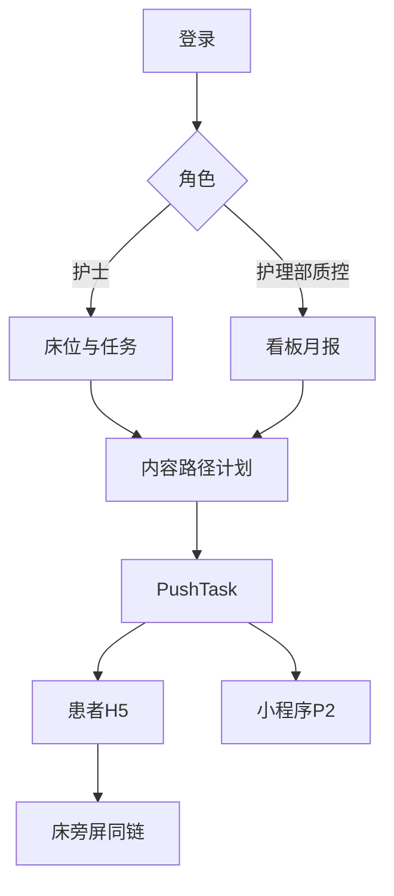

# 护理推送平台产品需求文件（PRD）

| 项 | 内容 |
| --- | --- |
| 产品名称 | 护理推送助手 |
| 版本 | V1.0 |
| 日期 | 2026-09-20 |
| 状态 | 草稿 |
| 配套 | [MRD-护理推送平台.md](MRD-护理推送平台.md)、[04-功能与用例分析.md](04-功能与用例分析.md) |
| 范围 | 勾选表(2) 纳入 59 项；延期 3 项不开发；不做 38 项不写需求 |

功能编号与勾选表一致。只描述**纳入**项的规则与验收。用例步骤以 UC01–UC12 为准，本文不重复长步骤，只补界面与对象。

## 1. 目标、非目标与分期

**目标**：P1 用医护 Web + 患者 H5 跑通路径作业与质控；床旁屏打开同一 H5。P2 患者小程序与订阅消息复用同一任务与阅读。

**非目标**：咨询、短信、HIS、服务号、电子签、交班催办、直播患友会、培训课件库、AI。15.1 不做，15.2 用问卷考试。16.6 不做，07.6 只出码。

| 期 | 范围 |
| --- | --- |
| P1 | 01.1–01.4（邀请先做链接）、02 纳入项、03 纳入项、04 全部、05 全部、06.1–06.3、07.1、07.6、08.1–08.3、09.1–09.5、11.1–11.3、12.1–12.5、13.1、13.3、15.2、16.1–16.4 |
| P2 | 07.3、07.4；01.4 升级微信码 |

## 2. 相对建议包的决策

| 变化 | 编号 | PRD 处理 |
| --- | --- | --- |
| 加 | 03.3 03.4 03.6 03.8 | 内容标签、共享、公共库、PDF 与变更记录 |
| 加 | 04.2 04.5 04.6 | 病种路径、审核、未读转当面补讲 |
| 加 | 05.3 05.6 06.3 | 音视频通知、群发确认、次日补推 |
| 加 | 02.8 01.4 | 入科表单、医护邀请 |
| 加 | 07.3 07.4 07.6 | 小程序、订阅消息、床旁出码 |
| 加 | 09.4 09.5 12.4 12.5 13.1 15.2 | 评分、满意度、24h 完成率、月报、站内通知、考试 |
| 减 | 07.2 10.x 08.4–08.7 03.5 11.5 13.2 17.2 | 不实现 |
| 改 | 01.6 | 不做多院切换，组织树仍可多科室 |

## 3. 角色权限

| 能力 | 护理部 | 护士长 | 责任护士 | 只读质控 | 患者 |
| --- | --- | --- | --- | --- | --- |
| 组织账号 | 读写 | 本科成员与邀请 | 只读本科 | 无 | 无 |
| 路径模板 | 全院写、提交 | 审核、启用本科 | 套用 | 只读 | 无 |
| 内容问卷 | 全院 | 本科 | 本科（设置可关新建） | 只读 | 读/答 |
| 分床 | 只读 | 分/改 | 领床范围内 | 只读 | 无 |
| 群发 | 可关 | 本科，全科须确认开关 | 默认责任床 | 无 | 无 |
| 智能计划 | 可关 | 本科 | 只读 | 无 | 无 |
| 今日任务 | 下钻 | 全科 | 责任床 | 只读 | 待学习 |
| 看板月报 | 全院 | 科室 | 本人 | 全院只读 | 无 |
| 考试 | 发布、成绩 | 本科成绩 | 应试 | 只读 | 无（患者问卷走 09） |
| 审计 | 全院 | 本科 | 无 | 全院 | 无 |

责任护士不进入 `/app/org`、`/app/nursing`、`/app/audit`。咨询开关在 13.3 可保留字段但**默认关且无咨询模块**。

## 4. 信息架构

路由：医护 `/app/*`，患者 `/p/{stayToken}/*`。小程序只映射患者学习页，不映射路径/计划/组织。

### 4.1 医护 Web

| 路由 | 页面 | 编号 |
| --- | --- | --- |
| `/app/login` | 手机号登录 | 01.3 |
| `/app/ward` | 床位图，默认责任床，护士长可切全科 | 02.1 02.4 05.5 |
| `/app/ward/beds/:bedId` | 档案、标记、码、阅读、套路径、转床出院、屏用链接 | 02.3 02.5 02.6 02.9 04.4 07.6 08.2 |
| `/app/tasks` | 待推 / 已推未读 / 当面补讲 | 08.3 04.6 |
| `/app/push/new` `/app/push/jobs` | 群发向导与记录、确认队列 | 05.1–05.6 |
| `/app/plans` | 智能计划 | 06.1–06.3 |
| `/app/content` | 文章、分类、标签、共享、公共库、PDF | 03.x 纳入项 |
| `/app/surveys` | 问卷、评分、满意度模板、回收导出 | 09.1–09.5 |
| `/app/pathways` | 路径编辑、审核、启用 | 04.1–04.5 |
| `/app/exams` | 分层考试发布与成绩 | 15.2 |
| `/app/team` | 成员、分床、邀请链接/码 | 01.4 02.4 |
| `/app/settings/education` | 自动出院、表单字段、授权文案、有效阅读秒数、群发确认开关、热线只展示不做咨询 | 13.3 02.8 16.3 |
| `/app/inbox-sys` | 系统通知 | 13.1 |
| `/app/stats/*` `/app/nursing` `/app/reports/monthly` | 科室/成员/全院/24h/月报 | 12.1–12.5 |
| `/app/org` `/app/audit` | 组织、审计 | 01.1 01.2 16.1 16.2 |

### 4.2 患者 H5

| 路由 | 页面 | 编号 |
| --- | --- | --- |
| `/p/:token/consent` | 授权 | 16.3 |
| `/p/:token/form` | 必填表单 | 02.8 |
| `/p/:token/center` | 分类 + 专病专区 | 11.1 11.3 |
| `/p/:token/inbox` | 待学习 / 已完成 | 11.2 |
| `/p/:token/articles/:id` | 阅读心跳 | 08.1 |
| `/p/:token/surveys/:id` | 问卷/患者侧考试卷 | 09.2 |

出院后 token 只读历史。转床可换码或改指向。

### 4.3 小程序（P2）

页：首页待学习、宣教中心、文章、问卷、消息授权。不包含路径编辑、计划、组织。

## 5. 功能需求（按模块，仅纳入）

### 5.1 组织与登录（01.1–01.4）

- 树：医院 / 院区 / 科室 / 病区。POC 单院多种室。
- 角色四种。手机号 + 密码或验证码。
- 邀请：P1 生成带科室与角色的一次性链接；P2 可出微信小程序码。加入须护士长确认或链接内已指定角色。
- **验收**：两种角色登录后导航不同；邀请链接只能加入指定科室。

### 5.2 患者与床位（02）

- 床位宫格：床号、脱敏姓名、责任护士、未读红点、标记色点。
- 档案：姓名、床号、入科时间、诊断/病种标签、联系人、手术日（可空）。Excel 导入。
- 分床、转床、出院；按宣教设置天数自动出院。
- 标记组本科室自定义。
- 一床一码；02.8 开启则扫码后必填配置字段才能进中心。
- **不做**：非病房列表、扫码人数上限、家属分策略、HIS。
- **验收**：导入 5 人分床后码可打开；自动出院日 24 点后任务停止新增。

### 5.3 内容（03）

- 分类树默认：入院、出院、检查、手术、疾病、护理、饮食、用药、康复。
- 文章：封面、富文本、音频/视频 URL 或上传；草稿/已发布。
- 疾病标签、关键词；范围：仅本科 / 院内共享；公共库引用到本科再发布。
- 变更记录；预览；导出 PDF。
- **不做**：秀米、读完弹问卷、代运营台。
- **验收**：共享文章另一科可引用；改标题后变更记录多一条；PDF 可下载。

### 5.4 路径（04）

- 步骤：锚点 `admitted_at` / `surgery_at` / `discharged_at` / `first_scan_at` + 偏移天 + 发送时刻。
- 条目：文章 / 问卷 / 通知 / 须当面。
- 病种路径与通用路径并列，用标签匹配，套用时可改选。
- 状态：草稿 → 待审核 → 已启用；护士长审核；启用到科室。
- 套用时**物化** PushTask，改模板不影响已套用 Stay。
- 04.6：到期未有效阅读的须学习条目自动进入当面补讲 Tab（与「须当面」条目合并去重）。
- **验收**：入院 +0 天条目在套用后出现在待推；未读次日出现在当面补讲；新版本不改已套用患者。

### 5.5 群发（05）

- 三步：内容（图文/文本/音频/视频）→ 筛选（在院、标记组、责任床/全科）→ 立即或定时。
- 全科且设置「须确认」时进入护士长队列，通过才发送。
- 留痕：发送人、时间、应发、已读；未读可重发（新 Delivery）。
- **验收**：责任护士界面无全科或选全科被拒；护士长驳回后患者收件箱无此条。

### 5.6 计划（06.1–06.3）

- 人群：标记组（可后续加路径，P1 用标记组）。
- 未读次日补推：同一 Task 增加一次 Delivery，默认补一次。
- 手术日空：跳过手术锚点，计划页显示缺日期人数。
- **验收**：扫码后 +1 天计划自动出现任务；未读次日有第二次投递记录。

### 5.7 渠道（07.1、07.3、07.4、07.6）

- P1 主渠道 `qr_h5`；床旁 `bedside` 与 H5 同 URL，另出「屏用」展示（大字码）。
- P2 `wechat_subscribe`；未授权订阅不影响 H5。
- **不做**短信、服务号、互联网医院、APP/邮件、屏厂 SDK。
- **验收**：同一 token 在手机与桌面浏览器（模拟屏）阅读都计入该 Stay。

### 5.8 阅读与任务（08.1–08.3）

- 事件：`open` / `heartbeat` / `complete`；阈值默认 30 秒，科室可配。
- Tab：待推 = pending 且到期；未读 = delivered 未达阈值；当面补讲 = bedside 类或 04.6。
- 护士「已当面完成」→ `done`。无签收、转交、催办。
- **验收**：停满阈值变已读；中途退出未达阈值仍在未读。

### 5.9 问卷与考试（09、15.2）

- 题型：单选、多选、填空；可配分值与等级文案。
- 护理满意度为系统模板问卷，可改题目权重。
- 路径或群发推送；回收导出脱敏。
- 考试：选已有评分问卷、对象（科室/角色标签）、时长、开放窗口；医护 Web 作答；成绩按人汇总。无课件、无学习进度。
- **验收**：提交后显示等级；导出无明文手机号；过期考试不可进。

### 5.10 患者中心（11.1–11.3）

- 分类浏览已发布本科内容；专病专区由护士长配置菜单（病种 → 分类或标签）。
- 待学习来自 Task，不是全库必读。
- **验收**：未推送的文章在中心可见、不在待学习；专病菜单可增删。

### 5.11 质控（12）

- 科室：今日新增 Stay、今日有效阅读人数、未读任务人数。
- 成员：责任护士覆盖率 = 有有效阅读的责任床 Stay / 责任床 Stay。
- 护理部：科室对比、时间筛选、导出。
- 路径 24h 完成率 = 套用后 24h 内该路径必学条目均有效阅读或当面完成的 Stay 比例。
- 月报：覆盖、未读、满意度均分或达标率、知晓率均分、24h 完成率；可下载。
- **验收**：演示数据下月报四项均有数字或「无回收」。

### 5.12 设置与通知（13.1、13.3）

- 系统通知：功能更新、待办汇总（如待确认群发），非意见反馈。
- 宣教设置：自动出院天数、表单字段、授权文案版本、热线号码（仅展示）、有效阅读秒数、群发确认、咨询 enabled=false 隐藏。

### 5.13 安全（16.1–16.4）

- 审计：stay.create、pathway.apply、job.send、exam.publish、export.* 等，无明文手机。
- 列表默认脱敏；导出权限：护士长本科、护理部/质控全院。
- 租户隔离强制带 `tenant_id`。
- **验收**：跨租户 API 404/空；审计能反查一条群发。

## 6. 用例与验收对照

| 用例 | 关键验收 |
| --- | --- |
| UC01 | 未审核路径不可套用 |
| UC02 | 套用后待推条数 = 到期步骤条目数 |
| UC03 | 拒授权或未填表进不了中心 |
| UC04 | 未读进当面补讲；点完成离开 Tab |
| UC05 | 全科群发可被驳回 |
| UC06 | 未读次日多一次 Delivery |
| UC07 | 导出含分与等级 |
| UC08 | 月报可下载 |
| UC09 | 无课件仍能出成绩表 |
| UC10 | P2：订阅到达且打开为同一 Task |
| UC11 | 屏浏览器打开同 token |
| UC12 | 共享与 PDF、变更记录 |

演示顺序见 [04-功能与用例分析.md](04-功能与用例分析.md) 第 6 节。

## 7. 核心对象

P1 即按多端设计。短信渠道枚举不实现。

| 对象 | 要点 |
| --- | --- |
| Tenant | 单院 POC；隔离键 |
| User / Membership | role 四值；wechat_openid P2 |
| Bed / Patient / Stay | 任务与码挂 Stay；consent、first_scan、surgery_at、表单 JSON |
| TagGroup / StayTag | 计划圈人 |
| Article | tags、shared_scope、变更日志 |
| Questionnaire / Response | scoring_rules；satisfaction 模板标记 |
| PathwayTemplate / Step / Item | status 含 pending_review；version |
| StayPathway | 套用快照 |
| PushJob | 确认状态 pending_approval / sent / rejected |
| PushPlan | unread_retry 次数默认 1 |
| PushTask | source pathway/manual_job/plan/exam；status pending/delivered/read/done/cancelled |
| Delivery | channel qr_h5 / bedside / wechat_subscribe |
| ReadEvent | client h5 / mp / bedside |
| Exam | 指向 questionnaire；audience；成绩视图 |
| AuditLog | actor、action、target、stay_id |
| EducationSettings | 阈值、表单 schema、consent_version |

任务状态：pending → delivered → read；当面路径 pending/delivered → done；出院 cancelled。

## 8. 非功能

- 心跳 10–15s，隐藏停记。
- 列表分页；导出异步可接受 P1 同步限 5000 行。
- 订阅消息遵守微信条数与一次性订阅；失败记 Delivery failed，不阻塞 H5。
- 密码哈希；验证码限流。
- 日志保留不少于 POC 周期；不含病历原文以外的宣教正文可选。

## 9. 附录 A 纳入 59

01.1 01.2 01.3 01.4；02.1 02.3 02.4 02.5 02.6 02.8 02.9；03.1 03.2 03.3 03.4 03.6 03.8；04.1 04.2 04.3 04.4 04.5 04.6；05.1 05.2 05.3 05.4 05.5 05.6；06.1 06.2 06.3；07.1 07.3 07.4 07.6；08.1 08.2 08.3；09.1 09.2 09.3 09.4 09.5；11.1 11.2 11.3；12.1 12.2 12.3 12.4 12.5；13.1 13.3；15.2；16.1 16.2 16.3 16.4。

## 10. 附录 B 延期 3

02.2 非病房名单；02.7 扫码人数上限；02.10 家属单独策略。

## 11. 附录 C 不做 38

01.5、01.6、02.11、03.5、03.7、03.9、06.4、06.5、07.2、07.5、07.7、07.8、08.4、08.5、08.6、08.7、09.6、09.7、10.1、10.2、10.3、10.4、10.5、10.6、11.4、11.5、12.6、13.2、14.1、14.2、14.3、15.1、16.5、16.6、17.1、17.2、17.3、17.4。
